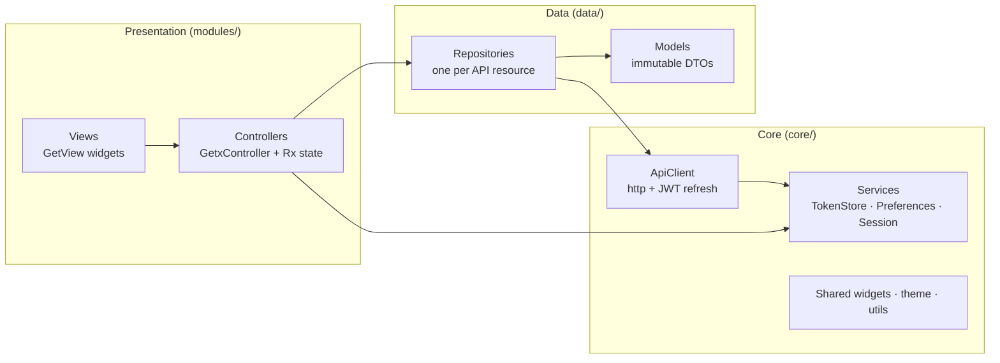
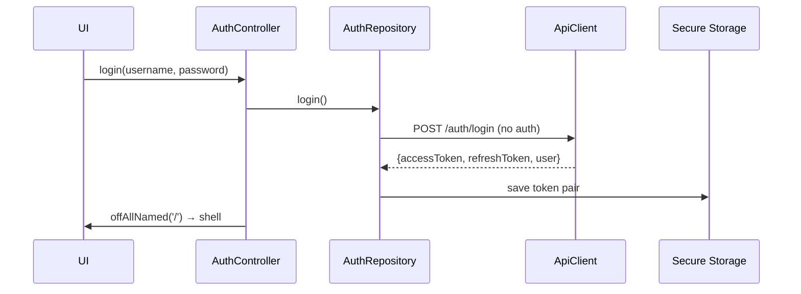
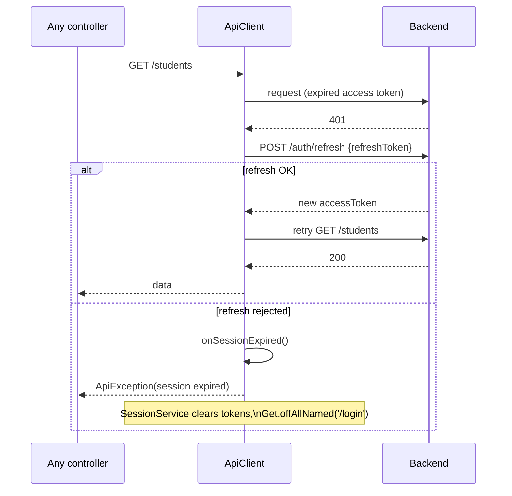

# Architecture

The app follows **Clean Architecture** adapted to Flutter + GetX: three layers
with dependencies pointing inwards, plus a thin composition root.

## Layers

### 1. Core (`lib/app/core/`)
Framework-level building blocks with **no knowledge of features**:

- **`network/ApiClient`** — the only place HTTP happens. Wraps
  `package:http`, prefixes the base URL, attaches `Authorization: Bearer`,
  decodes the `{code, message, data}` envelope and converts failures into
  typed `ApiException`s. On a 401 it performs a **single-flight refresh**
  (`POST /auth/refresh`) and retries the original request once; concurrent
  401s await the same refresh future. If refresh fails it fires
  `onSessionExpired` so the session layer can clean up and redirect.
- **`services/TokenStore`** — abstract token contract.
  `TokenStorageService` implements it with **flutter_secure_storage**
  (tokens never live in plain storage); tests use an in-memory fake.
- **`services/PreferencesService`** — **get_storage** for non-sensitive
  data: theme mode, remembered username, cached profile JSON.
- **`services/SessionService`** — the signed-in user as `Rxn<UserModel>`,
  permission checks for the UI, and `endSession()` (clear tokens + cache,
  go to login).
- **`base/PagedListController<T>`** — shared behavior of every list screen:
  loading/error state, page navigation, debounced search, pull-to-refresh
  and `runAction()` (mutation + snackbar + reload).

### 2. Data (`lib/app/data/`)
- **Models** — immutable DTOs with `fromJson` factories; `PagedData<T>`
  mirrors the backend page envelope generically.
- **Repositories** — one class per API resource (auth, users, roles,
  students, teachers, subjects, classes, enrollments, grades, dashboard,
  audit). They translate between JSON and models and expose typed methods.
  Controllers never build URLs or touch JSON.

### 3. Presentation (`lib/app/modules/`)
One folder per feature, following the **GetX pattern**:

- **Controller** (`GetxController`) — holds reactive state (`.obs`),
  calls repositories, exposes intent methods (`save`, `delete`, `enroll`…).
- **View** (`GetView<Controller>`) — pure widgets; rebuilds via `Obx`.
- **Dialogs** — feature-local form dialogs that stay open on backend
  validation errors so user input is never lost.

### Composition root
- **`main.dart`** initializes storage services before the first frame and
  registers permanent singletons (`Get.put`).
- **`bindings/app_bindings.dart`** — `InitialBinding` registers all
  repositories (`Get.lazyPut(fenix: true)`); each route's binding registers
  its controllers lazily, so a controller is created only when its screen
  is first shown.
- **`routes/`** — named routes + `GetPage` table.

## Key flows

### JWT authentication

### Transparent refresh on 401

### Permission-gated UI
The login/profile response carries the user's flattened permission codes
(`student.create`, `grade.update`, …). `SessionService.hasPermission()` is
checked when building menus, buttons and row actions, so e.g. `student1`
sees a read-only app while the backend still enforces the same rules with
HTTP 403.

## Design decisions worth defending

1. **`http` package + hand-written client** — a deliberate, small dependency
   surface. The refresh queue, envelope decoding and error typing live in
   ~180 readable lines that are fully unit-tested with `MockClient`.
2. **Tokens in secure storage, preferences in GetStorage** — sensitive vs.
   convenience data are physically separated.
3. **`PagedListController<T>`** — eight list screens share one tested
   implementation of pagination/search/error handling instead of eight
   copies.
4. **Dialogs return `Future<bool>` from controller actions** — a failed
   save keeps the dialog (and the user's input) alive; a successful one
   closes it and reloads the list.
5. **Master-index IndexedStack in the shell** — feature pages keep their
   state (scroll position, filters) while switching sections; pages are
   built lazily on first visit.
