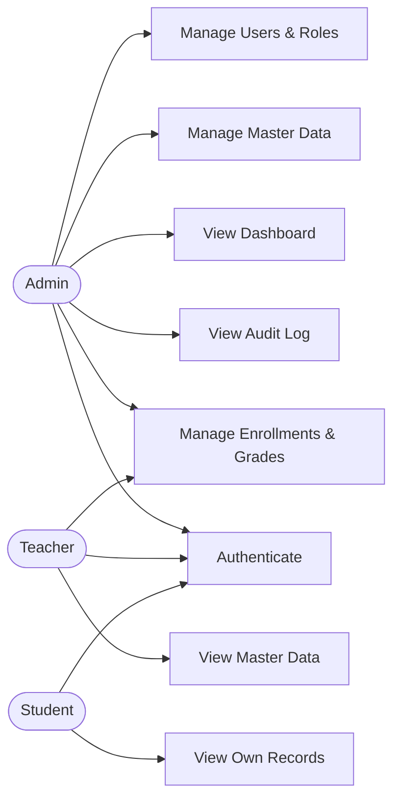

# 1. Requirement Analysis

## 1.1 Purpose

The School Management System (SMS) provides a secure back-office for managing a
school's core records: users of the system, master data (students, teachers,
subjects, classes), and the business transactions that connect them
(enrollments and grades). Every action is authenticated, authorized by role and
permission, validated, and audited.

## 1.2 Actors

| Actor | Description | Typical actions |
|-------|-------------|-----------------|
| **Admin** | System administrator (school office) | Manage users/roles, manage all master data, view dashboard & audit log |
| **Teacher** | Teaching staff | View master data, manage enrollments and grades for their classes |
| **Student** | Enrolled student (read-only account) | View own profile, enrollments, and grades |

## 1.3 Functional Requirements

### FR-A — Authentication

| ID | Requirement |
|----|-------------|
| FR-A1 | Users can log in with username/email and password and receive an access token (JWT) and a refresh token |
| FR-A2 | Users can refresh an expired access token using a valid refresh token |
| FR-A3 | Users can log out; the refresh token is revoked server-side |
| FR-A4 | Users can request a password reset; a one-time token/OTP is sent to their registered email and can be used once, within its expiry, to set a new password |
| FR-A5 | Passwords are stored only as BCrypt hashes; access tokens are short-lived |

### FR-U — User Management

| ID | Requirement |
|----|-------------|
| FR-U1 | Admin can create, read, update, and deactivate (soft-delete) users |
| FR-U2 | Admin can assign one or more roles to a user |
| FR-U3 | Each role carries a set of permissions (e.g. `student.create`, `grade.update`); endpoints are guarded by permission |
| FR-U4 | Users can view and update their own profile and change their own password |

### FR-D — Dashboard

| ID | Requirement |
|----|-------------|
| FR-D1 | Dashboard returns counts of students, teachers, subjects, classes, and enrollments |
| FR-D2 | Dashboard returns recent activity (latest enrollments, latest audit entries) |

### FR-M — Master Data (Students, Teachers, Subjects, Classes)

| ID | Requirement |
|----|-------------|
| FR-M1 | CRUD for Students, Teachers, Subjects, and Classes |
| FR-M2 | Every list endpoint supports pagination (`page`, `size`) and sorting |
| FR-M3 | Every list endpoint supports search (by code/name/keyword) |
| FR-M4 | Records use a status flag (`ACT`/`DEL`) — deletes are soft deletes |
| FR-M5 | Business codes (student code, subject code, …) are unique |

### FR-B — Business Module (Enrollment & Grades)

| ID | Requirement |
|----|-------------|
| FR-B1 | Admin/Teacher can enroll a student into a class; a student cannot be enrolled twice in the same class |
| FR-B2 | Admin/Teacher can record and update a grade (score per subject, per enrollment) |
| FR-B3 | Grades are validated (0–100) and stamped with who graded them |
| FR-B4 | Enrollments and grades can be listed per class and per student |

### FR-L — Audit Log

| ID | Requirement |
|----|-------------|
| FR-L1 | Every write operation (create/update/delete, login, logout) produces an audit entry: who, what action, which entity, when, and from which IP |
| FR-L2 | Admin can search the audit log by user, action, entity type, and date range (paginated) |

### FR-X — Cross-cutting

| ID | Requirement |
|----|-------------|
| FR-X1 | All request bodies are validated (Jakarta Bean Validation); errors return a consistent JSON error format |
| FR-X2 | All endpoints are documented in Swagger UI / OpenAPI 3 |
| FR-X3 | A Postman collection is provided for API integration testing |

## 1.4 Key User Stories (Sprint 2 backlog)

| ID | Story | Acceptance criteria |
|----|-------|---------------------|
| US-01 | As a user, I log in and receive tokens | Wrong password → 401; success → access + refresh token; login audited |
| US-02 | As a user, I refresh my access token | Expired/revoked refresh token → 403 with clear error code |
| US-03 | As a user, I reset my forgotten password | Token sent by email, single-use, expires; old password stops working |
| US-04 | As an admin, I manage users and their roles | CRUD works; deactivated user cannot log in; role change takes effect on next token |
| US-05 | As an admin, I manage students | Create/update validated; list is searchable and paginated; delete is soft |
| US-06 | As an admin, I manage teachers, subjects, classes | Same criteria as US-05 |
| US-07 | As a teacher, I enroll students into my class | Duplicate enrollment rejected with a clear message |
| US-08 | As a teacher, I record grades | Score outside 0–100 rejected; grade saved with grader identity |
| US-09 | As an admin, I see the dashboard | Counts match database contents |
| US-10 | As an admin, I inspect the audit log | Filter by user/action/date works; entries are immutable |

## 1.5 Non-Functional Requirements

| ID | Category | Requirement |
|----|----------|-------------|
| NFR-1 | Security | Stateless JWT auth; BCrypt password hashing; role/permission-based authorization on every protected endpoint |
| NFR-2 | Validation | Server-side validation on all inputs; no stack traces leaked to clients |
| NFR-3 | Maintainability | Layered architecture (controller → service → repository); one module = one package |
| NFR-4 | Data integrity | All schema changes via Flyway migrations; FKs and unique constraints in the database, not only in code |
| NFR-5 | Documentation | Swagger UI available in dev; README + design docs kept in `docs/` |
| NFR-6 | Auditability | Write operations traceable to a user and timestamp |
| NFR-7 | Usability | Simple admin web UI for the demo (login, CRUD screens, dashboard) |
