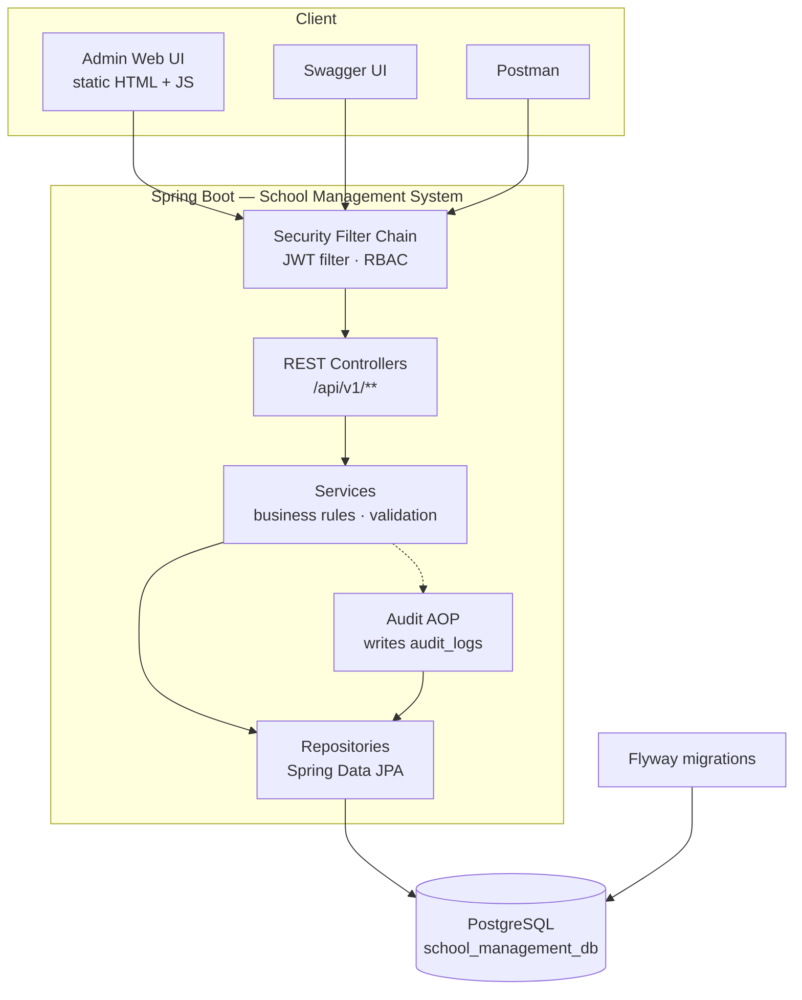
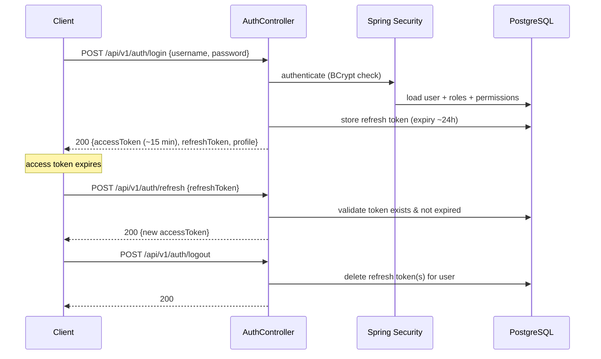

# 2. System Design

## 2.1 Architecture Overview

A classic three-layer Spring Boot monolith exposing a REST API, with a lightweight
static admin UI served by the same application. Stateless JWT security, PostgreSQL
managed by Flyway.



## 2.2 Design Decisions

| Decision | Choice | Rationale |
|----------|--------|-----------|
| Base package | `com.school.management` | Clean identity for the new project; old `com.dinsaren.springbootjwtapi` removed at end of Sprint 2 |
| Database | `school_management_db`, same PostgreSQL server & credentials (`postgres`/`1234`, localhost:5432) | Per project constraint |
| Schema management | Flyway only (`ddl-auto: none`) | Reproducible schema, migration history is part of the deliverable |
| API style | REST, JSON, versioned under `/api/v1` | Standard, easy to document with Swagger |
| Authorization | Roles → Permissions; endpoints guarded by permission (`@PreAuthorize("hasAuthority('student.create')")`) | Satisfies the roles-and-permissions requirement with fine granularity |
| Deletes | Soft delete via `status` column (`ACT`/`DEL`) | Preserves referential integrity and audit history |
| Audit log | AOP aspect + `@Auditable(action, entity)` annotation on service methods | One cross-cutting implementation instead of per-module code |
| UI | Static Bootstrap 5 + vanilla JS pages under `src/main/resources/static/` calling the REST API | No frontend build toolchain; one deployable; enough for the demo |
| Error handling | Global `@RestControllerAdvice` with a fixed error JSON shape | Consistent client experience, no leaked stack traces |

## 2.3 Package Structure

```
com.school.management
├── SchoolManagementApplication.java
├── config/            # WebSecurityConfig, OpenApiConfig, CORS
├── security/
│   ├── jwt/           # token provider, auth filter, entry point
│   └── service/       # UserDetailsServiceImpl, UserDetailsImpl
├── common/
│   ├── api/           # ApiResponse<T>, PageResponse<T>
│   ├── constant/      # Status, ErrorCode, Permissions
│   ├── exception/     # AppException, GlobalExceptionHandler
│   └── audit/         # @Auditable, AuditAspect
├── auth/              # controller, service, dto (login/refresh/logout/forgot-password)
├── user/              # user + role + permission management
├── dashboard/         # statistics endpoint
├── masterdata/
│   ├── student/       # controller, service, repository, entity, dto
│   ├── teacher/
│   ├── subject/
│   └── clazz/         # "class" is reserved in Java
├── enrollment/        # enrollment + grade (business module)
└── auditlog/          # audit log query API + entity
```

Each module keeps the same internal shape: `XController` → `XService` →
`XRepository` → `X` (entity) + `dto/` — so the structure itself documents the flow.

## 2.4 Security Design

### Login / refresh flow



- Access token: JWT signed with HMAC secret, ~15 minutes, carries username + authorities.
- Refresh token: opaque UUID stored in `refresh_tokens`, ~24 hours, deleted on logout.
- Forgot password: `POST /auth/forgot-password` generates a single-use token in
  `password_reset_tokens` (30 min expiry) and emails it; `POST /auth/reset-password`
  consumes it and BCrypt-hashes the new password. Used and expired tokens are rejected.

### Authorization model

```
User ──< user_roles >── Role ──< role_permissions >── Permission
```

- JWT authorities = the union of the user's roles (`ROLE_ADMIN`) and permissions (`student.create`).
- Controllers/services use `@PreAuthorize` with permissions; roles are the grouping mechanism.
- Default roles: `ROLE_ADMIN` (all permissions), `ROLE_TEACHER` (read master data,
  manage enrollments/grades), `ROLE_STUDENT` (read own data).

## 2.5 API Conventions

- Base path: `/api/v1`. Public: `/api/v1/auth/**`, Swagger, static UI. Everything else authenticated.
- Response envelope:

```json
{ "code": "OK", "message": "Success", "data": { } }
```

- Error shape (from `GlobalExceptionHandler`):

```json
{ "code": "E4001", "message": "Student code already exists", "errors": [ {"field": "code", "message": "..."} ] }
```

- List endpoints: `?page=0&size=10&sort=id,desc&search=keyword` returning
  `{ "content": [...], "page": 0, "size": 10, "totalElements": 42, "totalPages": 5 }`.

### Endpoint catalog

| Module | Method & path | Permission |
|--------|---------------|------------|
| Auth | `POST /auth/login`, `/auth/refresh`, `/auth/logout`, `/auth/forgot-password`, `/auth/reset-password` | public (logout: authenticated) |
| Users | `GET/POST /users`, `GET/PUT/DELETE /users/{id}`, `PUT /users/{id}/roles`, `GET /users/me`, `PUT /users/me/password` | `user.*` (me: authenticated) |
| Roles | `GET /roles`, `GET /permissions`, `PUT /roles/{id}/permissions` | `role.*` |
| Dashboard | `GET /dashboard/summary` | authenticated |
| Students | `GET/POST /students`, `GET/PUT/DELETE /students/{id}` | `student.*` |
| Teachers | `GET/POST /teachers`, `GET/PUT/DELETE /teachers/{id}` | `teacher.*` |
| Subjects | `GET/POST /subjects`, `GET/PUT/DELETE /subjects/{id}` | `subject.*` |
| Classes | `GET/POST /classes`, `GET/PUT/DELETE /classes/{id}` | `class.*` |
| Enrollments | `GET/POST /enrollments`, `DELETE /enrollments/{id}`, `GET /classes/{id}/enrollments`, `GET /students/{id}/enrollments` | `enrollment.*` |
| Grades | `POST/PUT /grades`, `GET /enrollments/{id}/grades`, `GET /students/{id}/grades` | `grade.*` |
| Audit log | `GET /audit-logs?user=&action=&entity=&from=&to=` | `audit.read` |

(All paths above are relative to `/api/v1`.)

## 2.6 Audit Logging Design

- `@Auditable(action = "CREATE", entity = "STUDENT")` on service write methods.
- `AuditAspect` (Spring AOP, after successful return) collects: current username,
  action, entity type, entity id, request IP, timestamp → inserts one `audit_logs` row.
- Login success/failure and logout are audited directly in `AuthService`.
- Audit entries are insert-only; no update/delete API exists.

## 2.7 UI Design (Sprint 2)

Static pages under `static/` using Bootstrap 5 and fetch-based JS with the JWT kept
in `localStorage`:

| Page | Content |
|------|---------|
| `login.html` | Login form, forgot-password link |
| `index.html` | Dashboard cards (counts) + recent activity |
| `users.html` | User table + role assignment modal |
| `students.html`, `teachers.html`, `subjects.html`, `classes.html` | CRUD tables with search + pagination |
| `enrollments.html` | Enroll student into class, grade entry per enrollment |
| `audit.html` | Audit log with filters |

## 2.8 Migration Plan from the Old Project

1. **Phase 1 — foundation**: switch `application.yml` to `school_management_db`,
   create new base package with security/common infrastructure (ported, not rewritten),
   fresh Flyway `V1`/`V2` migrations (old migrations removed together with the old DB).
2. **Phase 2 — modules**: auth → users/roles → master data → enrollment/grades →
   dashboard → audit log, each verified through Swagger before moving on.
3. **Phase 3 — UI + docs**: static admin UI, Postman collection, README refresh.
4. **Phase 4 — cleanup**: delete `com.dinsaren.springbootjwtapi.*`, old migrations,
   old Postman collection; rename Gradle project to `school-management-system`;
   full regression pass via Swagger + UI.
