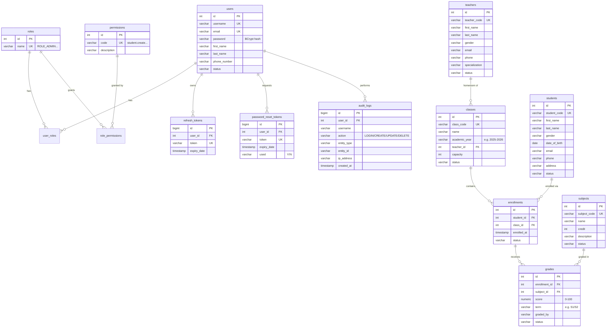

# 3. Database Design

## 3.1 Configuration

| Setting | Value |
|---------|-------|
| Database | `school_management_db` (PostgreSQL, single `public` schema) |
| Connection | `jdbc:postgresql://localhost:5432/school_management_db`, user `postgres` / `1234` (same server & credentials as the previous project) |
| Schema management | Flyway (`ddl-auto: none`), migrations in `src/main/resources/db/migration` |

Create the database once before first run:

```sql
CREATE DATABASE school_management_db;
```

## 3.2 Conventions

- Table names: plural snake_case. PKs: `id SERIAL`/`BIGSERIAL`.
- Every business table carries audit columns `created_at, created_by, updated_at, updated_by`
  (filled by the JPA `BaseEntity` superclass) and a `status VARCHAR(3)` soft-delete flag
  (`ACT` active / `DEL` deleted).
- FKs and unique constraints live in the database, not only in application code.

## 3.3 Entity–Relationship Diagram



## 3.4 Data Dictionary — key constraints

| Table | Constraint | Purpose |
|-------|------------|---------|
| `users` | `UNIQUE(username)`, `UNIQUE(email)` | No duplicate accounts |
| `user_roles` | `PK(user_id, role_id)`, FKs to both | Many-to-many users↔roles |
| `role_permissions` | `PK(role_id, permission_id)`, FKs to both | Many-to-many roles↔permissions |
| `refresh_tokens` | `UNIQUE(token)`, FK to users | One token per session, revocable |
| `password_reset_tokens` | `UNIQUE(token)`, `used` flag | Single-use reset tokens |
| `students` | `UNIQUE(student_code)` | Business identifier |
| `teachers` | `UNIQUE(teacher_code)` | Business identifier |
| `subjects` | `UNIQUE(subject_code)` | Business identifier |
| `classes` | `UNIQUE(class_code)`, FK `teacher_id → teachers` | Homeroom teacher optional (`NULL` allowed) |
| `enrollments` | `UNIQUE(student_id, class_id)`, FKs to both | Prevents double enrollment (FR-B1) |
| `grades` | `UNIQUE(enrollment_id, subject_id, term)`, `CHECK (score BETWEEN 0 AND 100)` | One grade per subject per term (FR-B3) |
| `audit_logs` | FK `user_id → users` (nullable for failed logins) | Insert-only trail |

## 3.5 Flyway Migration Plan

Fresh history in the new database (the old project's `V1`/`V2` are deleted together
with the old modules — they never run against `school_management_db`):

| Version | File | Content |
|---------|------|---------|
| V1 | `V1__create_auth_tables.sql` | `users`, `roles`, `permissions`, `user_roles`, `role_permissions`, `refresh_tokens`, `password_reset_tokens`, `audit_logs` |
| V2 | `V2__create_master_data_tables.sql` | `students`, `teachers`, `subjects`, `classes` |
| V3 | `V3__create_business_tables.sql` | `enrollments`, `grades` |
| V4 | `V4__seed_data.sql` | Roles, permissions, role-permission mapping, admin user, sample master data |

Rule for later changes: never edit an applied migration — add `V5__...` etc.

## 3.6 Seed Data (V4)

- **Roles**: `ROLE_ADMIN`, `ROLE_TEACHER`, `ROLE_STUDENT`.
- **Permissions**: `user`, `role`, `student`, `teacher`, `subject`, `class`,
  `enrollment`, `grade` × `create/read/update/delete`, plus `audit.read`,
  `dashboard.read`.
- **Mapping**: ADMIN → all; TEACHER → all `*.read` + `enrollment.*` + `grade.*`;
  STUDENT → `*.read` on own data (enforced in service layer).
- **Admin user**: `admin` / BCrypt hash of a default password (changed at first demo),
  role `ROLE_ADMIN`.
- **Sample data**: ~10 students, 4 teachers, 6 subjects, 3 classes, a handful of
  enrollments and grades so the dashboard and lists are not empty on first run.
